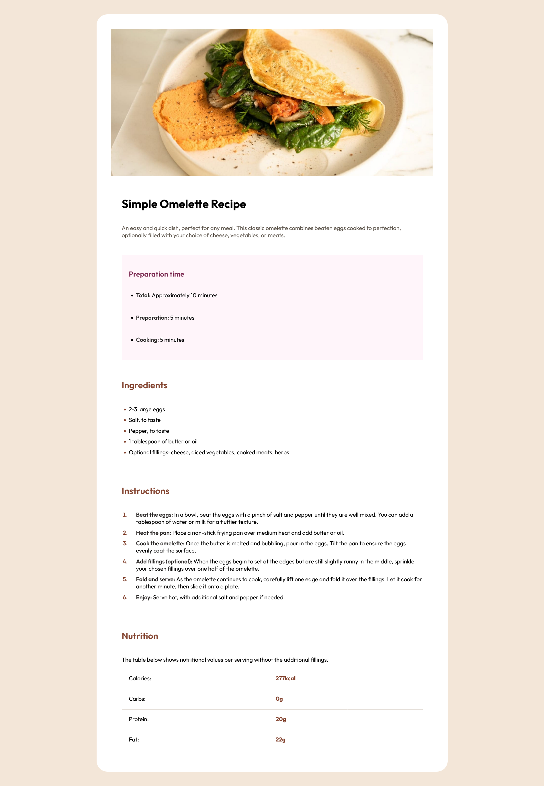

# Frontend Mentor - Recipe page

- First React TypeScript project.
- Also tried some SCSS with mixins and variables
- JSON used to load the data

## Screenshots

### Desktop

### Mobile

## Useful link to iterate through a typescript object

https://copyprogramming.com/howto/react-typescript-how-to-iterate-through-an-object
